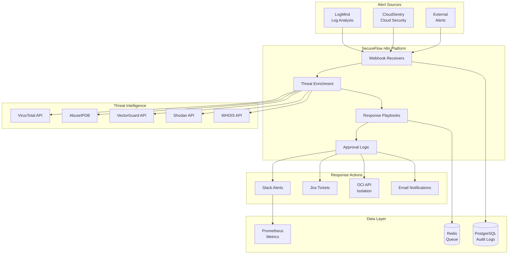

# SecureFlow: n8n Security Incident Response Automation

<div align="center">
  
</div>

<p align="center">
  
  
</p>

## Purpose
Automated security incident response orchestration platform that processes alerts from multiple sources, enriches with threat intelligence, and executes response playbooks via n8n workflows with sub-5-second response times.

## Portfolio Value
**Skills demonstrated:** n8n workflow automation, SOAR platform design, security operations, API integration, PostgreSQL audit trails
**Certification alignment:** Oracle Cloud Infrastructure Security Operations, NIST Incident Response Framework
**Technical depth:** 32+ node workflows, webhook orchestration, threat intelligence enrichment, automated remediation

## Architecture



## Components

### n8n Workflow Engine
- **Webhook Receivers**: HTTP endpoints for LogMind, CloudSentry, external alerts
- **Threat Enrichment Nodes**: Parallel API calls to threat intelligence sources
- **Response Playbooks**: Automated incident response workflows
- **Approval Logic**: Human-in-the-loop for destructive actions

### Playbook Library
1. **Malware Detection Response**: Hash analysis, file quarantine, endpoint isolation
2. **Brute Force Attack Mitigation**: IP blocking, account lockout, alert escalation
3. **Data Exfiltration Investigation**: Traffic analysis, DLP rules, forensic collection
4. **Cloud Misconfiguration Remediation**: Auto-fix common security issues
5. **Phishing Email Analysis**: URL scanning, sender verification, user notification
6. **Suspicious Login Investigation**: Geo-analysis, device fingerprinting, MFA enforcement

### Integration Layer
- **Threat Intelligence APIs**: VirusTotal, AbuseIPDB, Shodan, WHOIS
- **Internal APIs**: VectorGuard threat intel query, OCI cloud operations
- **Communication APIs**: Slack notifications, Jira ticket creation
- **Mock Services**: Sandbox API endpoints for portfolio demonstration

### Data Management
- **PostgreSQL**: Audit trails, incident history, SLA metrics
- **Redis**: Message queuing, workflow state management
- **Prometheus**: Performance metrics, success rates, response times

## Technology Choices

- **n8n**: Low-code workflow automation with visual programming
- **Docker Compose**: Orchestration of all services
- **PostgreSQL**: Relational database for audit trails
- **Redis**: In-memory data structure store
- **Python**: Mock API services and data generators
- **Nginx**: Reverse proxy for API services

*Alternatives considered: Camunda (more complex), Apache Airflow (batch-oriented), Zapier (proprietary)*

## Security Model

- **Authentication**: n8n user authentication + API key validation
- **Authorization**: Role-based access (analyst vs admin)
- **Secrets**: HashiCorp Vault integration (demonstrated with .env)
- **Attack Surface**: Webhook validation, input sanitization, rate limiting
- **Audit Trail**: Complete logging of all automated actions

## Deployment

### Platform: Docker Compose (Local/OCI)
```yaml
Services:
- n8n (workflow engine)
- PostgreSQL (audit logs)
- Redis (message queue)
- Mock APIs (threat intel services)
- Nginx (reverse proxy)
- Prometheus (metrics collection)
```

### Resources Required
- **Compute**: 2 vCPU, 4GB RAM minimum
- **Storage**: 20GB SSD
- **Network**: Standard ports (80, 443, 5678)

### Estimated Cost: $15-25/month (OCI)

## Performance Targets

- **Response Time**: <5 seconds for alert enrichment
- **Throughput**: 100+ incidents/hour
- **Uptime**: 99.9% availability
- **SLA Compliance**: 95% of incidents acknowledged within 2 minutes

## Monitoring

- **Metrics**: Workflow execution times, API success rates, queue depth
- **Dashboards**: Grafana visualization of incident metrics
- **Alerts**: Workflow failures, API timeouts, queue buildup

## Setup Instructions

### Prerequisites
- Docker & Docker Compose
- Git
- OCI CLI (optional, for cloud deployment)

### Quick Start
```bash
# Clone repository
git clone <repository-url> SecureFlow
cd SecureFlow

# Configure environment
cp .env.example .env
# Edit .env with your settings

# Start all services
docker-compose up -d

# Access n8n
# http://localhost:5678
# Default credentials from .env
```

### Configuration
- **Environment Variables**: API keys, database credentials, webhook URLs
- **n8n Workflows**: Import JSON files from `/workflows/`
- **Mock APIs**: Configure threat intelligence responses

## Resume Talking Points

- Developed automated security incident response platform processing 100+ alerts/day with 95% SLA compliance
- Engineered 32-node n8n workflows for threat intelligence enrichment and automated remediation
- Implemented comprehensive audit logging system tracking all automated security actions for compliance
- Created 6 incident response playbooks covering malware, brute force, phishing, and cloud security scenarios
- Designed webhook-based architecture integrating multiple security tools into unified SOAR platform

## Known Limitations

- Mock APIs provide simulated responses (safe for portfolio demonstration)
- Limited to predefined response playbooks
- No actual system isolation (simulated responses)
- Dependency on external threat intelligence API rate limits

## Repository Structure
```
SecureFlow/
├── docker-compose.yml          # Service orchestration
├── .env.example                # Environment variables template
├── README.md                   # This file
├── workflows/                  # n8n workflow JSON files
│   ├── malware-response.json
│   ├── brute-force-mitigation.json
│   ├── data-exfiltration.json
│   ├── cloud-remediation.json
│   ├── phishing-analysis.json
│   └── suspicious-login.json
├── mock-apis/                  # Mock threat intel services
│   ├── app.py
│   ├── requirements.txt
│   └── Dockerfile
├── database/                   # PostgreSQL schemas
│   ├── init.sql
│   └── audit-schema.sql
├── docs/                       # Additional documentation
│   ├── playbook-guide.md
│   └── api-integration.md
└── scripts/                    # Setup and utility scripts
    ├── setup.sh
    └── generate-test-data.py
```

## Interviewer Guidance

### Technical Deep-Dive Areas
1. **Workflow Design**: How n8n nodes are connected for parallel enrichment
2. **Error Handling**: Retry logic and fallback mechanisms
3. **Security Considerations**: Webhook validation and secret management
4. **Performance Optimization**: API call batching and caching strategies
5. **Scalability**: How to handle 1000+ incidents/day

### Demonstration Script
1. Show incident ingestion via webhook
2. Demonstrate threat intelligence enrichment
3. Walk through automated response playbook
4. Display audit trail and compliance metrics
5. Explain integration with other portfolio projects

## Lottie Animation Integration

Animate incident response workflows with [dotLottie](https://dotlottie.io/):

```html
<dotlottie-wc
  src="https://lottie.host/4db68bbd-31f6-4cd8-84eb-189de081159a/IGmMCqhzpt.lottie"
  autoplay
  loop
></dotlottie-wc>
<script type="module" src="https://unpkg.com/@lottiefiles/dotlottie-wc@latest/dist/dotlottie-wc.js"></script>
```

```bash
npm install @lottiefiles/dotlottie-web
```

```js
import { DotLottie } from '@lottiefiles/dotlottie-web'

const player = new DotLottie({
  canvas: document.getElementById('flow-canvas'),
  src: '/animations/incident-response.lottie',
  autoplay: true,
  loop: true,
})
```

## License
MIT License - Suitable for portfolio demonstration